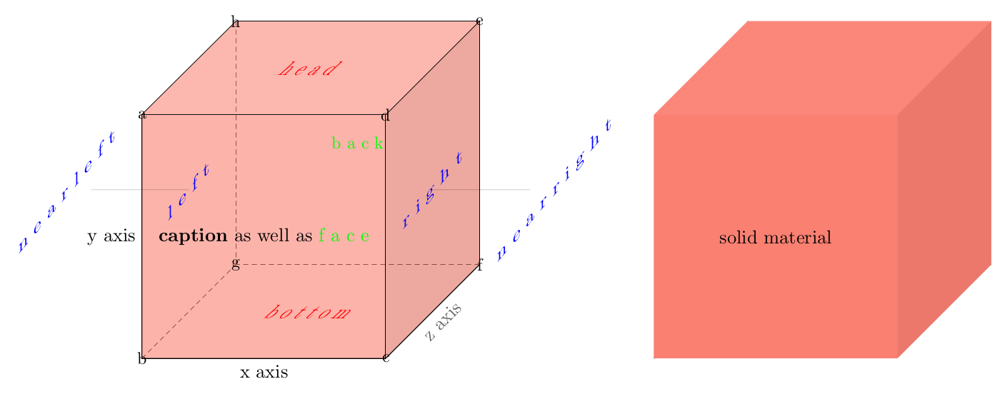
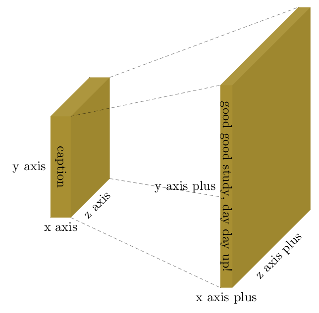
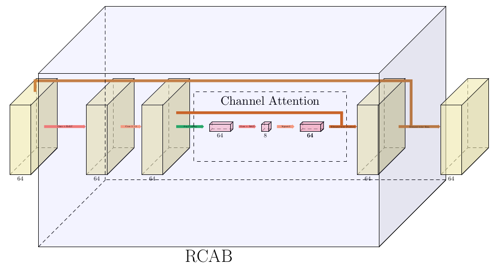
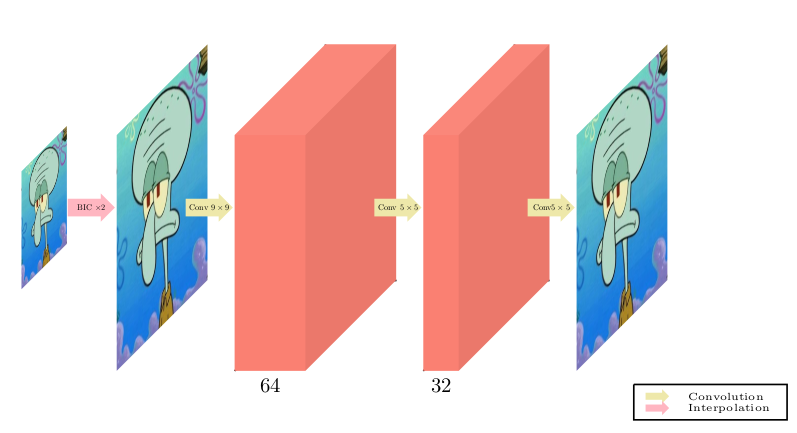
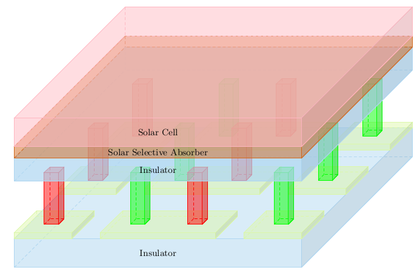

# Plot with tikz 3D

## Requirement

- pdflatex

## Files

```
|-- README.md
|-- layer
|   |-- Arrow.sty
|   |-- Ball.sty
|   `-- Box.sty
```

The `layer` directory contains self-defined shapes. Other directories are examples.

## How to use

To illustrate an independent figure `pdf`, use the following header in `.tex` file:
```
\documentclass[border=8pt, multi, tikz]{standalone}
\usetikzlibrary{quotes,arrows.meta,positioning,3d}
\usepackage{xcolor}
\usepackage{../layer/Box} % where self-defined boxes are located
\usepackage{../layer/Ball} % where self-defined boxes are located
\usepackage{../layer/Arrow} % where self-defined boxes are located
\begin{document}
\begin{tikzpicture}
    <your code>
\end{tikzpicture}
\end{document}
```

The building blocks defined in `layer` are `Box`, `Ball`, and `Arrow`. Take `Box` as an example.

Defining a box in latex

```
\pic[shift={(0,0,0)}] at (0,0,0)
    {BaseBox={
        name=demo, % variable name of this box instance
        caption=\textbf{caption} as well as \textcolor{green}{f a c e},
        opacity=0.6,
        xlabel=x axis, % text appears on x axis
        ylabel=y axis, % text appears on y axis
        zlabel=z axis, % text appears on z axis
        fill=<your color>, 
        scriptscale=1.1, % upscale the size of text
        width=5, %size of box
        height=5,
        depth=5,
        border=black
        }
    };
```

A list of anchor would be generated to present the relative coordinate with respect to this box starting with name `demo`. For example you can define another box at `demo-nearright` with:

```
\pic[shift={(3,0,0)}] at (demo-nearright)
    {BaseBox={
    < your configurations>
        }
    };
```
The anchors are:
```
        \coordinate (\name-left)   at (0,0,0) ;
        \coordinate (\name-right)   at (\x, 0,0) ;
        \coordinate (\name-face)  at (\x/2,0,\z/2);
        \coordinate (\name-back)  at (\x/2,0,-\z/2);
        \coordinate (\name-head) at (\x/2,\y/2,0);
        \coordinate (\name-bottom)  at (\x/2,-\y/2,0);
        \coordinate (\name-nearleft)   at (-\x/2,0,0) ;
        \coordinate (\name-nearright)   at (1.5*\x, 0,0) ;

        \coordinate (\name-a) at (0 , \y/2 , \z/2);
        \coordinate (\name-b) at (0 ,-\y/2 , \z/2);
        \coordinate (\name-c) at (\x    ,-\y/2 , \z/2);
        \coordinate (\name-d) at (\x    , \y/2 , \z/2);
        \coordinate (\name-e) at (\x    , \y/2 ,-\z/2);
        \coordinate (\name-f) at (\x    ,-\y/2 ,-\z/2);
        \coordinate (\name-g) at (0 ,-\y/2 ,-\z/2);
        \coordinate (\name-h) at (0 , \y/2 ,-\z/2);
        \coordinate (\name-k) at (0, 0, \z/2);
        \coordinate (\name-l) at (\x, 0, \z/2);
```

where `\name` refers to the name of variable defined above. A visual example is [](/boxbasic)

## Other Examples

[](/pixelshuffle)

[](/RCAB)

[](/SRCNN)

[](/solarcell)

## Reference

- [](https://doi.org/10.5281/zenodo.2526396)
- [repo from my previous account](https://github.com/Zi-angZhang/PlotNeuralNet)
